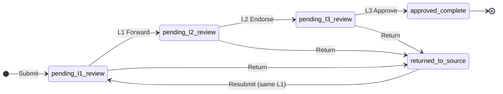

# DocuFlow

A secure document tracker with multi-level review, built for **DOST-STII**.
Capstone project — APC IT241, Group 6.

> This is a working **prototype**: it covers the two core use cases end to end
> and intentionally leaves out everything else (see [Scope](#scope)).

**Project files (SharePoint):** https://asiapacificcollege.sharepoint.com/:f:/s/RRunS/IgAOdc2diKNOR7H_olxV98Q0ARQv2Snh5x7NpUzIQaIh2Qs?e=tf7R9O

---

## Scope

The prototype implements exactly two use cases:

1. **Submit / Resubmit Document**: a Document Source submits a Google
   Workspace link or one file, and resubmits it after it is returned.
2. **Review Document**: three levels of reviewers return or move the
   document forward until it is approved.

Not included in the prototype: AI features, email (notifications are
in-app only), Google Workspace edit tracking, holiday calendars, admin or
user-management screens, dashboards, search and filters.

## Actors

| Actor | Can do |
|---|---|
| **Document Source** | Submit a document, resubmit it after it is returned |
| **Immediate Supervisor (L1)** | Return it, or Forward it to a chosen Section Head |
| **Section Head (L2)** | Return it, or Endorse it to the Division Chief |
| **Division Chief (L3)** | Return it, or Approve it |

## Review flow



### Business rules

- **Reference number:** `DOCTYPE-YYYY-NNNNN` (e.g. `MEMO-2026-00001`),
  numbered per document type per year. It never changes, even across
  resubmissions.
- **Document types:** Report, Policy Draft, Financial Record, Project
  Proposal, Memo, Other.
- **Uploads:** a `docs.google.com` / `drive.google.com` link **or** one
  `.pdf`, `.docx` or `.xlsx` file of up to 10 MB.
- **Self-Review Restriction:** nobody can pick themself as a reviewer or
  review a document they submitted.
- **Resubmission:** creates a new revision with a required change note and
  goes back to the same L1, at Level 1.
- **Turnaround time (TAT):** each review action records the calendar days
  since the document was assigned, with a rating of **5** (before day 5),
  **3** (on day 5) or **1** (after day 5).
- **Notifications:** every hand-off notifies the next person in the system.

## Tech stack

| Layer | Technology |
|---|---|
| Backend | Laravel 13 (PHP 8.3) |
| Frontend | React 18, connected to Laravel with Inertia.js (no separate API) |
| Styling | Tailwind CSS 3 + shadcn/ui-style components, Google Sans Flex, Material Symbols |
| Database | MySQL (production), SQLite or MySQL (local) |
| Document preview | Google Workspace `/preview` embeds, native PDF, docx-preview (Word), SheetJS (Excel) |
| Hosting | Railway |

## Project structure

DocuFlow uses the standard Laravel + Inertia layout: Laravel serves every
page and hands the data to a React page component, so the frontend and
backend live in one project rather than two separate apps.

```
app/
  Http/Controllers/        Backend: request handling
    DocumentController.php   submit, resubmit, lists, document page, file access
    ReviewController.php     Return / Forward / Endorse / Approve
  Models/                  Backend: User, Document, DocumentRevision, Review, Notification
database/
  migrations/              Backend: database tables
  seeders/                 Backend: test accounts for each role
routes/
  web.php                  Backend: every URL in the app
resources/
  js/                      Frontend (React)
    Pages/                   one component per screen (Documents/, Reviews/, Auth/)
    Components/              shared pieces (table, preview, review panel, status badge)
    Components/ui/           design-system primitives (button, input, card, ...)
    Layouts/                 sidebar layout and login layout
  css/app.css              Frontend: design tokens (colors) and Tailwind
  views/app.blade.php      the single HTML shell the React app mounts into
docs/                      course deliverables (diagrams, meeting minutes, reports)
```

## Running locally

**You need:** PHP 8.3+, Composer, Node.js 20.19+ (or 22.12+), and SQLite or
MySQL. [Laragon](https://laragon.org/) on Windows provides all of these.

```bash
composer install
npm install
cp .env.example .env
php artisan key:generate
php artisan migrate --seed
```

`.env.example` uses SQLite by default. To use MySQL instead, set
`DB_CONNECTION=mysql` and fill in the `DB_*` values in `.env` before running
the migrations.

Then start the app with two terminals:

```bash
php artisan serve    # Laravel, at http://127.0.0.1:8000
npm run dev          # Vite, serves and hot-reloads the React code
```

Open http://127.0.0.1:8000 and log in. `php artisan migrate --seed` creates a
test account for each role; there is no sign-up page.

> Uploads up to 10 MB need PHP's `upload_max_filesize` and `post_max_size`
> set above 10M in your `php.ini`.

## Deployment (Railway)

The app runs on Railway with a MySQL service and a volume mounted at
`/app/storage/app`, so uploaded files survive redeploys.

```bash
railway up --service DocuFlow --ci                             # build and deploy
railway ssh --service DocuFlow -- php artisan db:seed --force  # first time only
```

Migrations run automatically when the container starts. The seeder only
needs to run once on a new database; running it again is safe.
